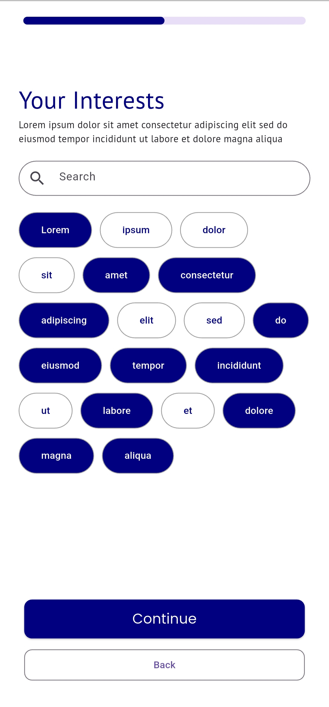
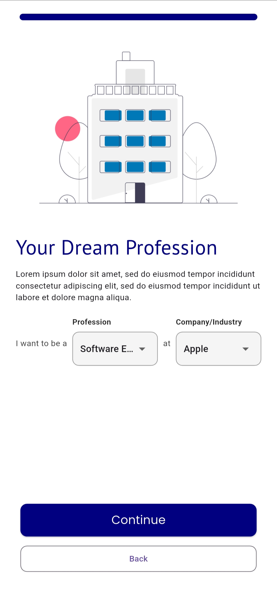

# Flutter Project Design and Development 
## Internship Assignment

 I have developed Flutter application that replicates the provided UI designs with high accuracy. Every element has been carefully implemented to match the reference PNGs, ensuring pixel-perfect alignment, consistent styling, and responsive layout. Special attention was given to typography, color scheme, spacing, and widget behavior to maintain design integrity.

## Screenshots of the App:

                                                                              
